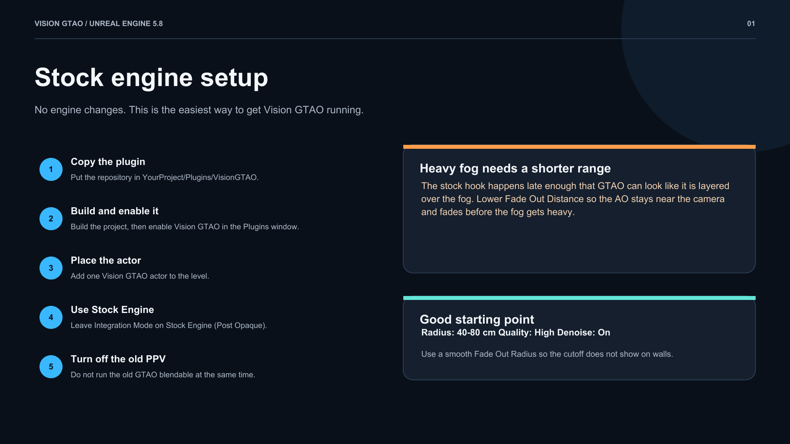
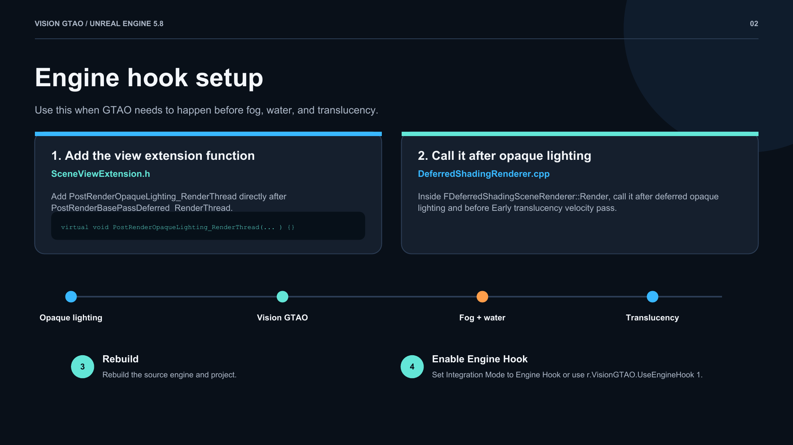
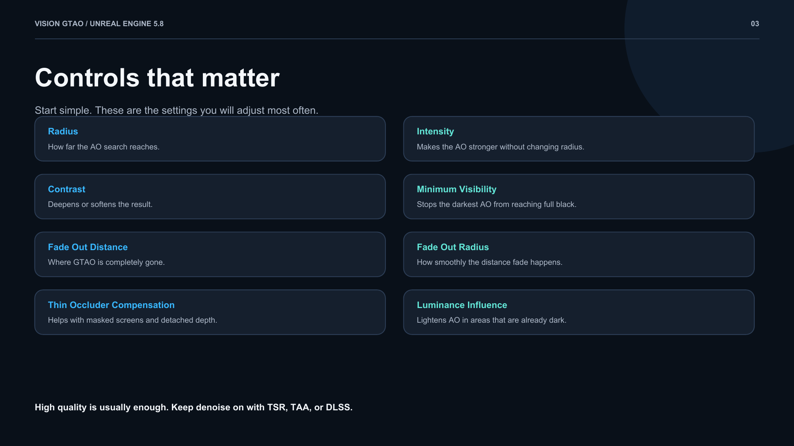

# If this plugin helps you out, wishlist [Microwave Simulator](https://store.steampowered.com/app/2921590/Microwave_Simulator/) on Steam.

# Vision GTAO

Vision GTAO is my Unreal Engine 5.8 adaptation of Intel's XeGTAO. I made it because I wanted the fine contact AO from my old Post Process Volume version without being stuck with a late PPV blendable.

There are two ways to run it:

- **Stock Engine** works without engine changes and is the default.
- **Engine Hook** needs two small engine source changes, but it places GTAO before fog, water, and translucency. This is the version I use when I need the rendering order to be right.

Disable the old PPV GTAO blendable before using this plugin or you will apply AO twice.







The same pages are available as a [PDF](output/pdf/VisionGTAO-Quick-Start.pdf).

## Stock engine setup

1. Copy this repository to `YourProject/Plugins/VisionGTAO`.
2. Build the project and enable **Vision GTAO**.
3. Place one **Vision GTAO** actor in the level.
4. Leave **Integration Mode** on **Stock Engine (Post Opaque)**.
5. Disable the old PPV GTAO blendable.

### Important fog note

The stock hook happens late enough that GTAO can look like it is layered over the fog. In scenes with heavy fog, a lower `Fade Out Distance` is better. Keep the effect close to the camera and let it fade before the fog becomes heavy.

The engine hook does not have this problem because GTAO is applied after opaque lighting but before fog, water, and translucency.

## Engine hook setup

This needs a source-built Unreal Engine. The locations below are for Unreal Engine 5.8.

### 1. Add the view extension function

Open `Engine/Source/Runtime/Engine/Public/SceneViewExtension.h` and add this directly after `PostRenderBasePassDeferred_RenderThread`:

```cpp
virtual void PostRenderOpaqueLighting_RenderThread(FRDGBuilder& GraphBuilder, FSceneView& InView, TRDGUniformBufferRef<FSceneTextureUniformParameters> SceneTextures) {}
```

### 2. Call it after opaque lighting

Open `Engine/Source/Runtime/Renderer/Private/DeferredShadingRenderer.cpp`.

Inside `FDeferredShadingSceneRenderer::Render`, find the end of the deferred opaque lighting section. In UE 5.8, I placed this immediately before `// Early translucency velocity pass`:

```cpp
if (bRenderDeferredLighting)
{
	for (const TSharedRef<ISceneViewExtension>& ViewExtension : ViewFamily.ViewExtensions)
	{
		for (FViewInfo& View : Views)
		{
			ViewExtension->PostRenderOpaqueLighting_RenderThread(GraphBuilder, View, SceneTextures.UniformBuffer);
		}
	}
}
```

Rebuild the engine and project, then set the Vision GTAO actor's **Integration Mode** to **Engine Hook**. You can also use `r.VisionGTAO.UseEngineHook 1`.

If Epic moves the renderer code in another engine version, the order still needs to be:

```text
Opaque lighting -> Vision GTAO -> Fog / Water / Translucency
```

## Settings that matter

| Setting | What it does |
| --- | --- |
| Radius | How far the AO search reaches around a pixel |
| Intensity | Makes the AO stronger without changing its radius |
| Contrast | Deepens or softens the AO response |
| Minimum Visibility | Raises the darkest value so AO cannot reach full black |
| Fade Out Distance | Distance where GTAO is completely gone |
| Fade Out Radius | Width of the distance fade |
| Thin Occluder Compensation | Helps with masked screens and detached foreground depth |
| Quality | High is what I normally use; Cinematic costs much more for a small difference |
| Luminance Influence | Lightens GTAO in already-dark areas |

Keep denoise enabled when using TSR, TAA, or DLSS.

## Colored penumbra

The actor also has an optional colored AO penumbra. White keeps the scene hue, while saturation and intensity control how visible it is. This is an artistic effect, so use whatever looks right for the scene.

## Requirements

- Unreal Engine 5.8
- Deferred renderer
- SM5 or newer
- A C++ project or a project that can build C++ plugins
- A source-built engine only for Engine Hook mode

This alpha has been used on Windows with D3D12 and SM6. Other platforms and RHIs have not been tested yet.

## Credits

Vision GTAO is licensed under the [MIT License](LICENSE). The GTAO work is adapted from Intel's MIT-licensed [XeGTAO](https://github.com/GameTechDev/XeGTAO). See [third-party notices](THIRD_PARTY_NOTICES.md).
